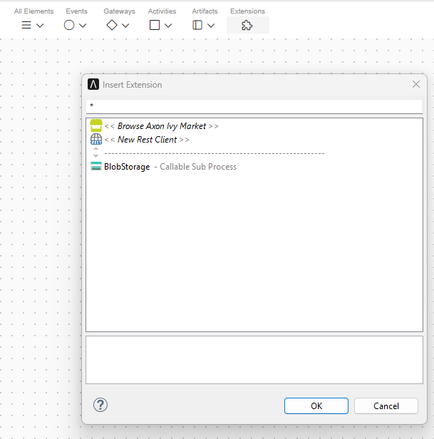

# Azure Blob Connector

Axon Ivy’s Azure Blob Connector helps you to connector Azure Blob Services quitly:
- Configuration to authorize access to blobs.
- Support upload content to blob with many kind of inputs.
- Support get download link with expired time.

## Setup

In the project, you only add the dependency in your pom.xml and call public APIs

**1. Add dependency**
```XML
	<dependency>
		<groupId>com.axonivy.cloud.storage</groupId>
		<artifactId>azure-blob-connector</artifactId>
		<version>${process.analyzer.version}</version>
	</dependency>
```
**2. Azure Blob connection in variables**

You need to provide Azure Blob connection in variables.yaml. Below is an example for connect by client secret
```yaml
Variables:
  AzureBlob:
    # The application ID that's assigned to your app.
    ClientId: ''
    # The client secret that you generated for your app in the app registration portal.
    ClientSecret: ''
    # The directory tenant the application plans to operate against, in GUID or domain-name format.
    TenantId: ''
    # https://<storage-account>.blob.core.windows.net/
    EndPoint: ''
    # Your container name.
    ContainterName: ''
```

## For Process GUI
**1. What is support in BlobStorage Callable Sub Process?**
 

**2. How to call an event from BlobStorage Callable Sub Process?**
- From Extensions on Tool Bar, we can see a BlobStorage element


- We can draw a process with uploadFromUrl selection and field some information like: external url, blob name, the directory on Azure Blob Container, .. 


## For Java Developer
**1. Call the constructor to set some basic information.  Each instance of the advanced process analyzer should care about one specific process model. This way we can store some private information (e.g. simplified model) in the instance and reuse it for different calculations on this object.**
```java
	/** 
	 * @param process - The process that should be analyzed.	 
	 */
	public AzureBlobStorageService(BlobServiceClient blobServiceClient, String container)
```

**2. Application requests to Azure Blob Storage must be authorized. You must to create a BlobServiceClient.**

  -  This credential authenticates the created service principal through its client secret
```java
	/**
	 *  Create client to a storage account. 
	 * @param clientId - the client ID of the application
	 * @param clientSecret - the secret value of the Microsoft Entra application.
	 * @param tenantId - the tenant ID of the application.
	 * @param endpoint - URL of the service
	 * @return a {@link BlobServiceClient} created from the configurations in this builder
	 */
	public static BlobServiceClient getBlobServiceClient(String clientId, String clientSecret, String tenantId, String endpoint) {}
```

  -  This credential authenticates the created service principal through its connection string
```java
	/**
	 * Create client to a storage account. 
	 * @param connectionString - connection string of the storage account
	 * @param endpoint - URL of the service
	 * @return  a {@link BlobServiceClient} created from the configurations in this builder
	 */
	public static BlobServiceClient getBlobServiceClient(String connectionString, String endpoint) {
```

 -  This credential authenticates the created service principal through its account and key. 
```java
	/**
	 * * Create client to a storage account. 
	 * @param accountName The account name associated with the request.
     * @param accountKey The account access key used to authenticate the request.
	 * @param endpoint - URL of the service
	 * @return  a {@link BlobServiceClient} created from the configurations in this builder
	 */
	public static BlobServiceClient getBlobServiceClient(String accountName, String accountKey, String endpoint) {}
```

**3. You can call `uploadFromUrl` to upload a file from url, `getDownloadLink`  to get download link of a blob.**
```java
	/**
	 * The API to copy operation from a source object URL
	 * @param url - The source URL to upload from
	 * @return - The blob name
	 */
	public String uploadFromUrl(String url);
	
	/**
	 * The API to create a temporary download link with expired time 
	 * @param url - The blob name
	 * @return - The url for download
	 */
	public String getDownloadLink(String blobName);
```	

## Example

Below is a simple example for upload a file from url and get temporary download link.
```
	BlobServiceClient blobServiceClient = BlobServiceClientHelper.getBlobServiceClient(CLIENT_ID, SECRET_VALUE,TENANT_ID, END_POINT);
	StorageService storageService = new AzureBlobStorageService(blobServiceClient, TEST_CONTAINTER);

	// Upload file from url
	String blobName = storageService.uploadFromUrl("https://sample.com/video.mp4");
	// Get temporary download link
	String downloadLink = storageService.getDownloadLink(blobName);
```


