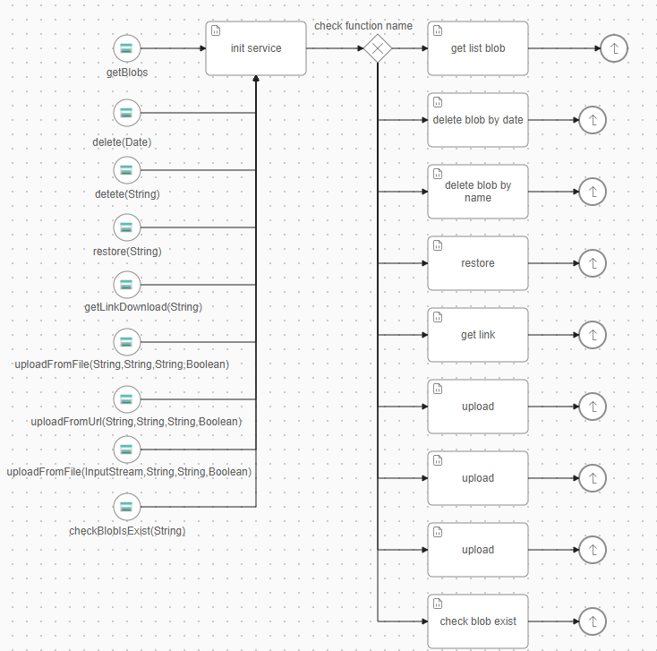
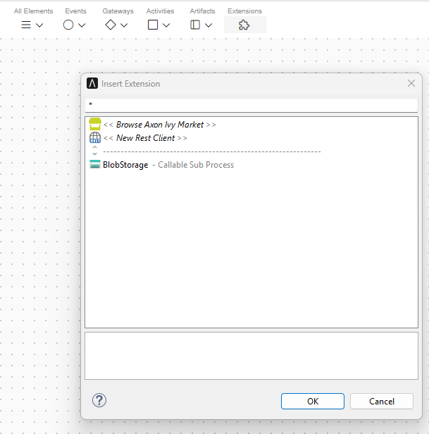
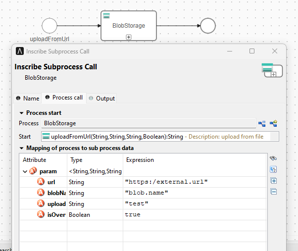

# Azure Blob Storage

Azure Blob Storage ist ein cloudbasierter Objektspeicherdienst von Microsoft
Azure. Damit können Sie große Mengen unstrukturierter Daten wie Bilder, Videos
und Dokumente skalierbar und kostengünstig speichern. Die Daten werden in
Containern innerhalb eines Speicherkontos gespeichert und sind über HTTP/HTTPS
zugänglich, sodass sie sich ideal für die Integration in Ihre Axon
Ivy-Geschäftsprozesse eignen.

Dieser Konnektor:
- Unterstützt Sie bei der Implementierung des Zugriffs auf Azure Blob Storage.
- Unterstützt Sie beim Hochladen von Inhalten in Ihren Azure Blob Storage –
  direkt aus einem Axon Ivy-Geschäftsprozess heraus.
- Erstellt einen Download-Link mit einem Ablaufdatum.

## Einrichtung

In dem Projekt fügen Sie lediglich die Abhängigkeit in Ihre pom.xml ein und
rufen öffentliche APIs auf.

**1. Abhängigkeit hinzufügen**
```XML
	<dependency>
		<groupId>com.axonivy.connector</groupId>
		<artifactId>azure-blob-connector</artifactId>
		<version>${process.analyzer.version}</version>
	</dependency>
```
**2. Azure Blob-Verbindung in Variablen**

Sie müssen die Azure Blob-Verbindung in variables.yaml angeben. Nachfolgend
finden Sie ein Beispiel für die Verbindung über einen geheimen Client-Schlüssel.
```yaml
Variables:
  AzureBlob:
    # The application ID that's assigned to your app.
    ClientId: ''
    # The client secret that you generated for your app in the app registration portal.
    ClientSecret: ''
    # The directory tenant the application plans to operate against, in GUID or domain-name format.
    TenantId: ''
    # The storage endpoint: https://<storage-account>.blob.core.windows.net
    BaseUrl: ''
    # Your container name.
    ContainerName: ''
```

> [!HINWEIS] Die Variable „ `“ „AzureBlob.ContainterName“ „` “ wurde ab Version
> 13.1.4 in „ `“ „AzureBlob.ContainerName“ „` “ umbenannt.

### Für Prozess-GUI
**1. Was wird in BlobStorage Callable Sub Process
unterstützt?**

**2. Wie ruft man ein Ereignis aus dem BlobStorage Callable Sub Process auf?**
- Im Menü „Erweiterungen” in der Symbolleiste sehen wir nun ein
  BlobStorage-Element 

- Wir können einen Prozess mit der Auswahl „uploadFromUrl“ erstellen und einige
  Informationen eingeben, wie z. B.: externe URL, Blob-Name, Verzeichnis auf
  Azure Blob Container, ...



### Für Java-Entwickler
**1. Rufen Sie den Konstruktor auf, um einige grundlegende Informationen
festzulegen.**
```java
	/**
	 * Create a AzureBlobStorageService with the give identity credential, storage account
	 * and container
	 * 
	 * @param tokenCredential - The credential type	 
	 * @param container       - The container name
	 */	
	public AzureBlobStorageService(Credential tokenCredential, String account, String container) {}
```

**2. Anwendungsanfragen an Azure Blob Storage müssen autorisiert werden. Sie
müssen eine Anmeldeinformation erstellen.**

  -  Diese Anmeldeinformation authentifiziert den erstellten Dienstprinzipal
     über sein Clientgeheimnis.
```java	
	/**
	 * Creates a ClientSecretCredential with the given identity client options.
	 * 
	 * @param clientId     - the client ID of the application
	 * @param clientSecret - the secret value of the Microsoft Entra application.
	 * @param tenantId     - the tenant ID of the application.
	 */
	public ClientSecretCredential(String tenantId, String clientId, String clientSecret) {}
```

 -  Diese Anmeldeinformationen authentifizieren den erstellten Dienstprinzipal
    über sein Konto und seinen Schlüssel.
```java	
	/**
	 * Creates a credential with specified {@code name} that authorizes request with
	 * the given {@code key}.
	 * 
	 * @param name - The name of the key credential.
	 * @param key  - The key used to authorize requests.
	 */
	public AzureNamedKeyCredential(String accountName, String accountKey) {}

```

**3. Sie können „uploadFromUrl“ aufrufen, um eine Datei von einer URL
hochzuladen, und „getDownloadLink“, um den Download-Link eines Blobs
abzurufen.**
```java
	/**
	 * The API to copy operation from a source object URL
	 * @param url - The source URL to upload from
	 * @return - The blob name
	 */
	public String uploadFromUrl(String url);

	/**
	 * The API to create a temporary download link with expired time
	 * @param url - The blob name
	 * @return - The url for download
	 */
	public String getDownloadLink(String blobName);
```

### Beispiel

Nachfolgend finden Sie ein einfaches Beispiel für das Hochladen einer Datei von
einer URL und das Abrufen eines temporären Download-Links.
``` java
	Credential tokenCredential = new ClientSecretCredential(TENANT_ID, CLIENT_ID, SECRET_VALUE);
	storageService = new AzureBlobStorageService(tokenCredential, STORAGE_ACCOUNT, TEST_CONTAINER);

	// Upload file from url
	String blobName = storageService.uploadFromUrl("https://sample.com/video.mp4");
	// Get temporary download link
	String downloadLink = storageService.getDownloadLink(blobName);
```

## Demo

### Lokal mit Azurite Docker Image ausführen

Starten Sie Docker, um Azure Blob Storage lokal zu testen.

##### Rufen Sie das Azurite V3-Docker-Image ab und führen Sie es aus.

> Hinweis: Weitere Docker-Image-Tags finden Sie unter
> <https://mcr.microsoft.com/v2/azure-storage/azurite/tags/list>

```bash
docker pull mcr.microsoft.com/azure-storage/azurite
```

```bash
docker run -p 10000:10000 -p 10001:10001 -p 10002:10002 mcr.microsoft.com/azure-storage/azurite
```

`-p 10000:10000` macht den Standard-Listening-Port des Blob-Dienstes sichtbar.
`-p 10001:10001` macht den Standard-Listening-Port des Queue-Dienstes sichtbar.
`-p 10002:10002` macht den Standard-Listening-Port des Table-Dienstes sichtbar.

#### Installation mit Docker Compose

Führen Sie im Stammverzeichnis des Projekts folgenden Befehl aus:
```
make app_local_compose_up
```

Weitere Möglichkeiten finden Sie unter
[DockerHub](https://github.com/Azure/Azurite/blob/main/README.md#dockerhub).

### Wie kann man die Daten erkunden?

- Installieren Sie
  „https://azure.microsoft.com/en-us/products/storage/storage-explorer“.
- Einrichtung für den Zugriff darauf

Weitere Informationen finden Sie auch im [Storage
Explorer](https://learn.microsoft.com/en-us/azure/storage/storage-explorer/vs-azure-tools-storage-manage-with-storage-explorer).

Geben Sie einen Kontonamen und einen Kontoschlüssel in variables.yaml mit [Well
Known Storage Account And
Key](https://learn.microsoft.com/en-us/azure/storage/common/storage-use-azurite?tabs=visual-studio%2Cblob-storage#well-known-storage-account-and-key)
an.

[StorageAccountAndKey](images/DevAccountKey.png)

